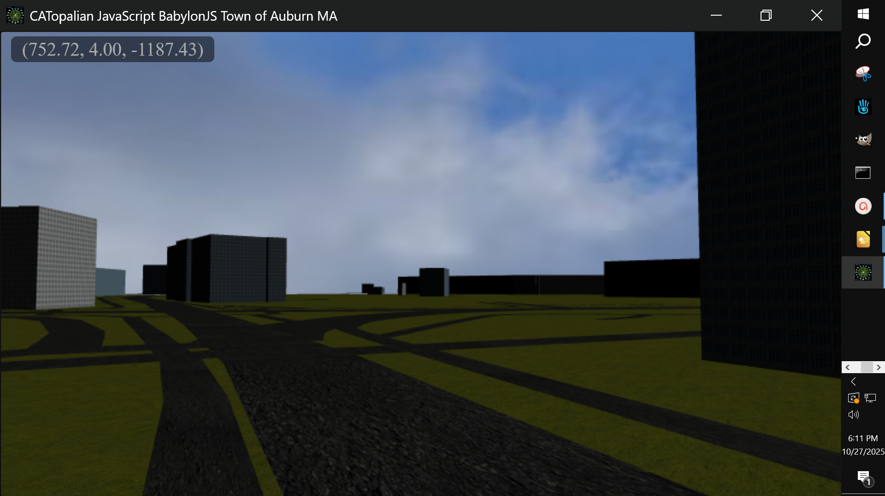
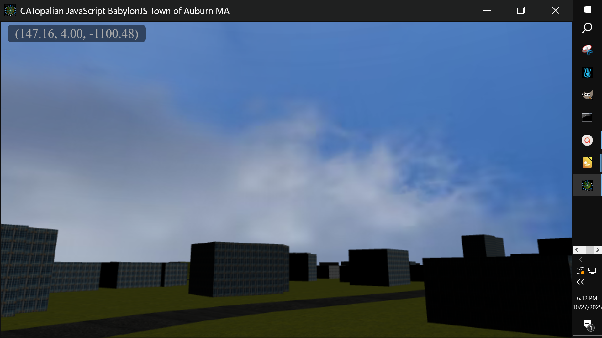
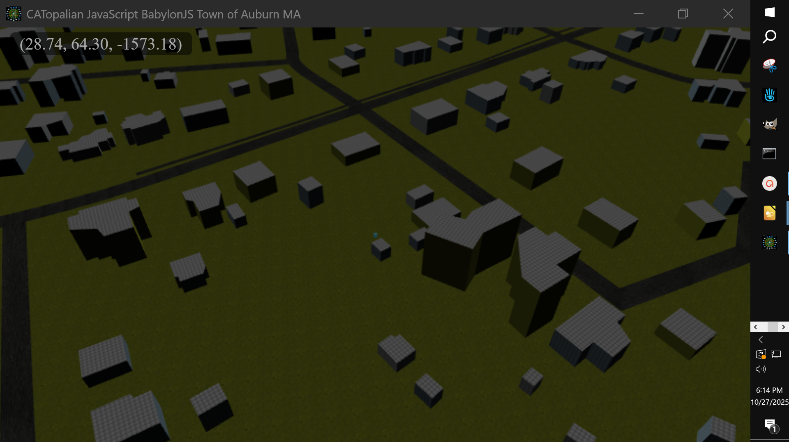
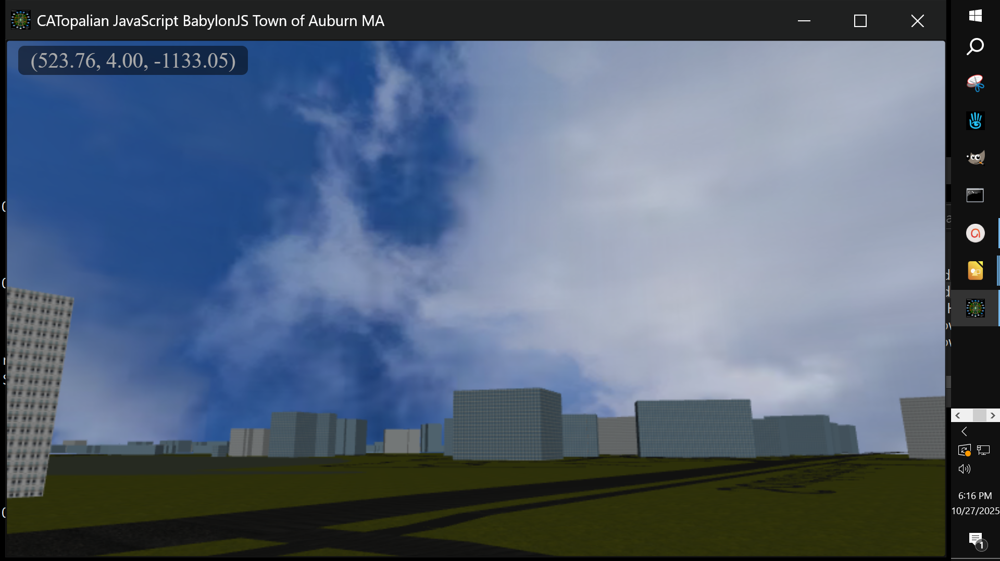

# CATopalian_JavaScript_BabylonJS_Town_of_Auburn_MA
Presenting the **Town of Auburn, Massachusetts** in 3D :-) using **JavaScript** **Babylon.js**

---

Video: https://youtu.be/Ouat8rb7Ruo

Use App: https://christopherandrewtopalian.github.io/CATopalian_JavaScript_BabylonJS_Town_of_Auburn_MA/CATopalian_JavaScript_BabylonJS_Town_of_Auburn_MA/CATopalian_JavaScript_BabylonJS_Town_of_Auburn_MA.html

---

## REQUIREMENTS:

> ### Node.js https://nodejs.org/en/download

> ### NW.js https://nwjs.io/  

---

## To Run this Application we:
* **Download** NW.js
* **Extract All**
* Find the **nw.exe** icon
* **Drag** the **FOLDER** named **CATopalian_JavaScript_BabylonJS_Town_of_Auburn_MA** onto the **nw.exe** icon  

---

### How to Download this App
1. Click the Green **Code** Button on this github page
2. Choose **Download ZIP**
3. **Save** the Zip File
4. **Extract All**
5. **Drag** the **CATopalian_JavaScript_BabylonJS_Town_of_Auburn_MA** Folder on to the **nw.exe** to start the App

---

Happy Scripting :-)

---

//----//  

// Dedicated to God the Father  
// All Rights Reserved Christopher Andrew Topalian Copyright 2000-2025  
// https://github.com/ChristopherTopalian  
// https://github.com/ChristopherAndrewTopalian  
// https://sites.google.com/view/CollegeOfScripting

